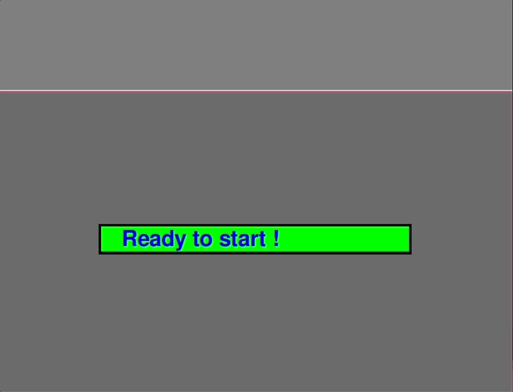

# Turtle Race


## Table of Contents

- [Turtle Race](#turtle-race)
  - [Table of Contents](#table-of-contents)
  - [Overview](#overview)
  - [Live Demo](#live-demo)
  - [Gameplay Demo](#gameplay-demo)
  - [Why I Built This](#why-i-built-this)
  - [Technology](#technology)
  - [Features](#features)
  - [Getting Started](#getting-started)
  - [Installation](#installation)
  - [How to Play](#how-to-play)
  - [Deployment](#deployment)
  - [Future Improvements](#future-improvements)
  - [License](#license)
  - [Acknowledgements](#acknowledgements)
  - [Contact](#contact)

## Overview

Turtle Race is a fun, basic, interactive game that allows players to bet on which turtle will win a race. Initially inspired by a Python course project using the Turtle package, this project evolved into a game using Pygame and Pygbag, making it deployable on the web for anyone to play.

## Live Demo

[Play Turtle Race Online](https://alanabf.github.io/Turtle-Race/)

## Gameplay Demo



## Why I Built This

The inspiration for this project came from my ongoing journey to master Python. After creating a simple Turtle Race using the Turtle package, I wanted to make the game accessible to a wider audience. This led me to explore Pygame for game development and Pygbag for deploying Python games on the web. The game you're about to experience is a recreation of that Turtle Race but with a more generalised approach using Pygame.

## Technology


  
## Features

- Interactive Gameplay: Players can place bets on which turtle (represented by colored squares) they think will win the race.
- Randomised Race Mechanics: The race outcome is randomised, making each game unique.
- Responsive Design: The game scales well to different screen sizes.
- Web Deployment: Using Pygbag, the game can be played directly in a web browser without the need for any installations.

## Getting Started

You can play the Turtle Race game online or run it locally on your machine. Follow the instructions below to get started!

## Installation

To run the game locally, you'll need Python installed on your machine along with the required dependencies. Follow these steps:

1 Clone the Repository:

```bash
git clone https://github.com/AlanaBF/Turtle-Race
cd turtle-race
```

2 Install Dependencies: Ensure you have Python installed, and then install the dependencies:

```bash
pip install pygame asyncio
```

3 Run the Game: Execute the Python script to start the game:

```bash
python main.py
```

## How to Play

1 Place Your Bet: At the start of the game, you will be prompted to choose a color representing one of the turtles. Type your choice and submit it.

2 Watch the Race: The turtles will race across the screen, with the winner being declared at the end.

3 Play Again: After the race, you’ll be given the option to play again or exit the game.

## Deployment

The game is also deployable on the web using Pygbag. Follow these steps to deploy the game on GitHub Pages:

1 Prepare the Project for Web Deployment:

- Install Pygbag:

```bash
pip install pygbag
```

- Build the project for the web:

```bash
pygbag main.py
```

2 Deploy to GitHub Pages:

- Commit the built files (located in the build/web directory) to the gh-pages branch of your GitHub repository.
- Go to the repository settings on GitHub and enable GitHub Pages, selecting the gh-pages branch as the source.

3 Access the Game:

- Once deployed, your game will be accessible at [Turtle Race Game](https://alanabf.github.io/Turtle-Race/).

## Future Improvements

Here are some ideas for future development:

- **Visual Effects:** Add animations and special effects to make the race more engaging.
- **User Interface:** Improve the UI with more polished interaction elements.
- **Mobile Compatibility:** Optimise the game for a better experience on mobile devices.

## License

This project is licensed under the MIT License - see the LICENSE file for details.

## Acknowledgements

Special thanks to the developers of Pygame and Pygbag for making game development and deployment accessible.
Thanks to my course instructors and the Python community for ongoing support and resources.

## Contact

If you have any questions or suggestions, feel free to reach out:

- Email: [alanabarrett-frew@hotmail.com](mailto:alanabarrett-frew@hotmail.com)
- GitHub: [AlanaBF](https://github.com/AlanaBF)
